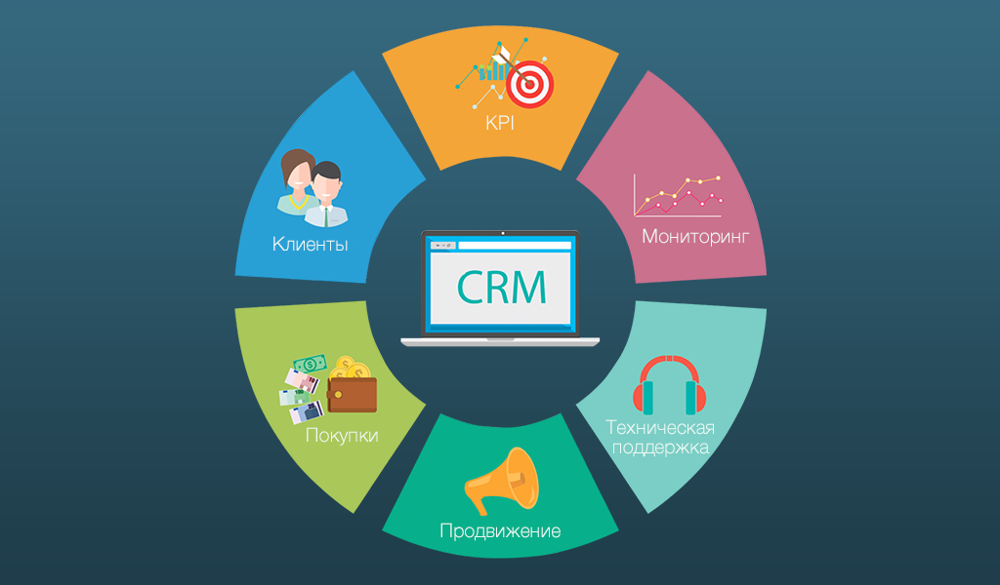
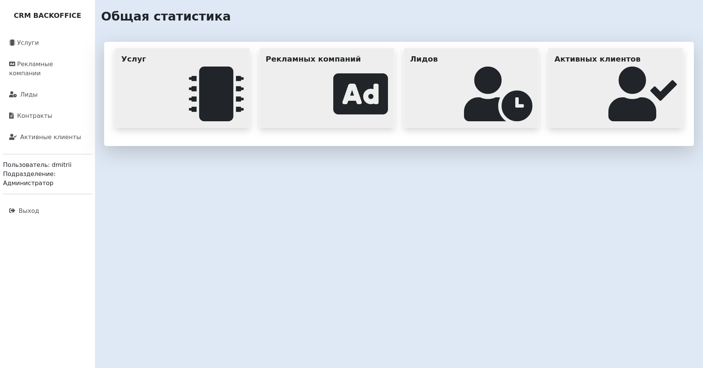

# CRM-система



В данном проекте представлена CRM-система, которая поможет автоматизировать процессы привлечения клиентов, обработки запросов и составления договоров. 
В CRM-системе сотрудники могут:
• вести учет услуг, предлагаемых компанией;
    • запускать и завершать рекламные кампании;
    • учитывайте потенциальных клиентов, заинтересованных в конкретной рекламной кампании;
    • переводите клиентов из статуса "потенциальных" в статус "активных" при составлении договоров о сотрудничестве.

Приложение реализовано на фреймворке Django с СУБД PostgreSQL. 

## Установка

Для запуска приложение необходимо выполнить несколько шагов, описанных далее

### Шаги установки:

1. **Клонирование репозитория:**
   
   Для установки необходимо клонировать репозиторий с помощью следующей команды:
   ```bash
   git clone https://github.com/DmitriiViktorov/CRM-system
   ```

2. **Установка зависимостей**
   
   Создайте виртуальное окружение и установите зависимости:

   ```bash
   python -m venv venv
   source venv/bin/activate  # Для Windows используйте venv\Scripts\activate
   pip install -r requirements.txt
    ```
   
3. Создание базы данных:
    
    Перед выполнением миграций необходимо создать базу данных в PostgreSQL (убедитесь, что PostgreSQL запущен на вашем устройстве).
    Для этого используйте пользовательскую команду Django:

   ```bash
   python manage.py create_db
   ```

4. **Выполните миграции**

   Перейдите в директорию с проектом и примените миграции для настройки базы данных:

   ```bash
   cd crm_system/
   python manage.py makemigrations
   python manage.py migrate
    ```
   
5. **Заполнение базы данных (опционально)**

    Для проверки работы CRM-системы к проекту приложен бекап демонстрационных данных,
    для их загрузки в базу данных необходимо выполнить скрипт ниже:

      ```bash
      python manage.py loaddata db_dackup.json
      ```   
   
6. **Запуск сервера**
   
   ```bash
   python manage.py runserver
   ```

    После успешного запуска сервис будет доступен по адресу http://127.0.0.1:8000/


## Подробности работы приложения

Основные функции приложения:

- авторизация пользователя;
- создание, редактирование и просмотр предоставляемых услуг;
- создание, редактирование и просмотр рекламной кампании;
- создание, редактирование и просмотр потенциальных клиентов;
- создание, редактирование и просмотр контракта для клиента;
- перевод потенциального клиента в активного;
- подсчёт и отображение статистики по рекламным кампаниям: сколько привлечено потенциальных клиентов, сколько из них перешло в активных.

В проекте существует 4 основные роли:

- **Администратор** может создавать, просматривать и редактировать пользователей, назначать им роли и разрешения. Такой функционал реализует административная панель Django.
- **Оператор** может создавать, просматривать и редактировать потенциальных клиентов (**лидов**).
- **Маркетолог** может создавать, просматривать и редактировать предоставляемые **услуги** и **рекламные кампании**.
- **Менеджер** может создавать, просматривать и редактировать **контракты**, смотреть потенциальных клиентов и переводить их в **активных**.
- Все роли могут смотреть **статистику** рекламных кампаний.

## Внешний вид интерфейса



## Контактная информация

В случае возникновения вопросов, комментариев, замечаний по работе приложения вы можете связаться со мной:
- Email: viktorovokrl@gmail.com
- Github: https://github.com/DmitriiViktorov/twitter
- Telegram: https://t.me/ViktorovDV
